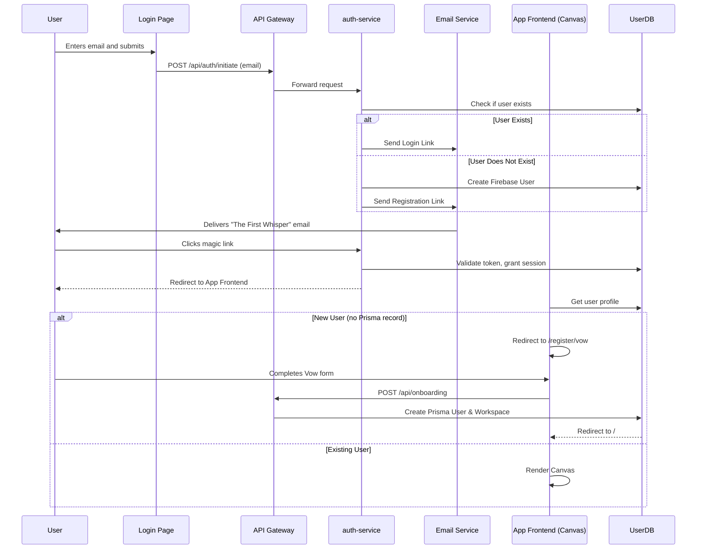

# ΛΞVON OS: The Rite of Invocation Protocol
Document Version: 1.1
Codename: The First Crossing
Status: Canonized
Author: ARCHIVEX

1. Doctrinal Statement
In the world of SaaS, onboarding is a checklist. In ΛΞVON OS, it is an initiation. The Rite of Invocation is the user's first and most important ritual. It is a carefully orchestrated journey designed to filter for intent, establish a user's sovereign identity, and attune the OS to their core purpose before they issue their first command.
This protocol defines the narrative flow, user experience, and technical architecture of this critical process. We are not acquiring users; we are welcoming Initiates. This is their first step.

2. The Pilgrim's Path: A Five-Step Ritual
The Rite of Invocation is a linear, narrative journey that takes a user from the public Sanctum to their own private Canvas.

Step 1: The Threshold
Location: The Chancel (the final realm of the aevonos.com Sanctum or the /login page).
User Action: The user is presented not with a "Sign Up" button, but with a single input field and a prompt: "State your designation." The user enters their email address.
System Response: The system initiates the authentication flow. It silently checks if the user exists. If not, an identity is forged in Firebase. In either case, the UI transitions to a confirmation state: "The ether has heard your call. Await the echo."

Step 2: The First Whisper
Location: The user's email inbox.
User Action: The user receives an email from oracle@aevonos.com. The email is minimalist, containing no marketing language.
Content:
Subject: The Echo
A path has opened. To cross the threshold, you must follow this echo before it fades.
[Cross the Threshold] (This is a single-use magic link)
This echo will dissipate in 15 minutes.

Step 3: The Crossing & The Vow
Location: The user's web browser, then the ΛΞVON OS application.
User Action: The user clicks the magic link.
System Response (Returning User): The user is authenticated and taken directly to their Canvas.
System Response (New User): The user is authenticated and then seamlessly transitioned to the "Vow Chamber" (`/register/vow`), where they are presented with a multi-step form to declare their intent.
The Sacrifice: They must state what old way of working must end.
The Vow: They must state what new reality they will build.
The Canvas Name: They must name their digital nation.
The Agent's Alias: They must give a name to their agentic voice.
The Covenant: They must choose one of three archetypal paths (The Architect, The Sovereign, or The Oracle). This choice is permanent and sets their User Psyche.

Step 4: The Awakening
Location: The ΛΞVON OS application itself.
User Action: The new user completes the Vow form.
System Response: The user's submission is processed by the `interpretVow` agent, which forges a `foundingBenediction` and a personalized `firstWhisper`. The user is then transitioned to their newly materialized Canvas. It is clean but not empty.
The Obelisk of Genesis stands at its center.
Their personal Psyche-Matrix mandala appears, its base color determined by their Vow.
A small, curated set of starter Micro-Apps, relevant to their Vow, are pre-arranged on the Canvas.

Step 5: The First Command
Location: The user's new Canvas.
System Response: After a moment of silence, the user is presented with their `firstWhisper` in a unique UI element (e.g., a "First Whisper Card"). This is a direct, personalized call to action, their first Ritual Quest.
Example: "The vow is made. The sacrifice is burned. Your first Ritual Quests have been inscribed to guide your path. Shall I summon them?"
If the user accepts, BEEP executes the `firstCommand` (e.g., `launch ritual quests`).
The Rite is complete. The user is now an Initiate, not a user.

3. Architectural & Technical Implementation
This ritual is orchestrated by a precise interplay between the frontend and the auth-service.

4. The Mechanical Impact of The Vow
The Vow is not merely flavor text. It has tangible effects on the user's starting experience:
BEEP's Persona: As detailed in Step 5, it sets the initial persona for BEEP's greeting.
Starter Micro-Apps: It determines the initial layout of the Canvas.
Architect: Starts with Instruments for project management and workflow design.
Sovereign: Starts with Instruments for tracking finances and economic Folly.
Oracle: Starts with Instruments for data analysis and search.
Daemon's Aura: When the Daemon first materializes, the subtle aura around its crystalline form will be colored according to the Vow (Imperial Purple for Sovereign, etc.).
This protocol ensures that a user's entry into ΛΞVON OS is a powerful, memorable, and doctrinally pure experience that immediately establishes the unique rules of our world.
